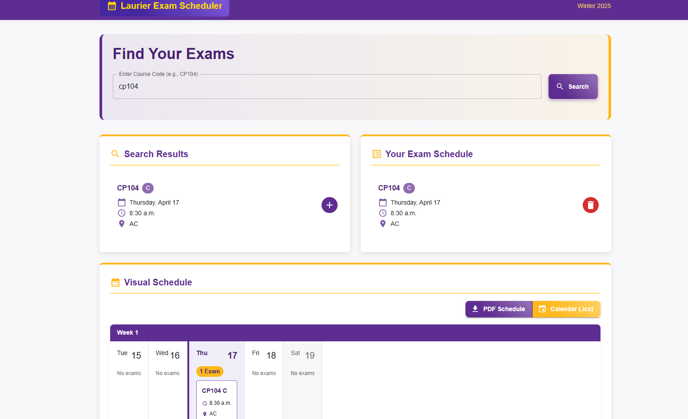

# Laurier Exam Scheduler

This project is a comprehensive exam scheduler designed for Laurier University, benefiting over 20,000 students. It utilizes a PostgreSQL database to store all exam-related information, a Spring Boot application to create a RESTful API for the backend, and a ReactJS frontend for intuitive user interaction.

https://examscheduler-mu.vercel.app/

## Features

- **PostgreSQL Database:** Stores detailed information about exams, including dates, times, courses, locations, and more.
- **Spring Boot Backend:** Provides a robust RESTful API to manage exam data efficiently. The backend is packaged as a Dockerfile and hosted on Railway.
- **ReactJS Frontend:** A user-friendly interface for viewing, adding, editing, and deleting exam information. The frontend is hosted on Vercel.

## Prerequisites

Before running this project locally, ensure you have the following installed:

- Java Development Kit (JDK) 17 or higher
- Node.js and npm (Node Package Manager)
- PostgreSQL database
- IDE (IntelliJ IDEA, Eclipse, VS Code, etc.)

## Installation

### Backend Setup

1. Clone this repository.
2. Open the `backend` directory in your preferred IDE.
3. Configure the `application.properties` file in the `src/main/resources` directory with your PostgreSQL database credentials.
4. Run the Spring Boot application.

### Frontend Setup

1. Navigate to the `frontend` directory in your terminal.
2. Run `npm install` to install the necessary dependencies.
3. Update the `src/config.js` file with the appropriate backend API URL.
4. Run `npm start` to start the ReactJS application.

## Deployment

### Railway Backend Deployment

The backend is optimized for Railway deployment. See the detailed deployment guide in `backend/RAILWAY_DEPLOYMENT.md`.

**Quick Setup:**
1. Connect your repository to Railway
2. Provision a PostgreSQL database in Railway
3. Set the required environment variables (see `backend/env.example`)
4. Deploy!

### Environment Variables

The application uses environment variables for configuration. Key variables include:
- `DATABASE_URL`: PostgreSQL connection string
- `DATABASE_USERNAME`: Database username
- `DATABASE_PASSWORD`: Database password
- `PORT`: Application port (default: 8080)
- `ALLOWED_ORIGINS`: CORS allowed origins

## Usage

- Access the frontend application via `http://localhost:3000`.
- Use the provided API endpoints to perform CRUD operations on exam data:
  - `/api/exams` - GET all exams, POST a new exam, DELETE all exams.
  - `/api/exams/{examId}` - GET, PUT, or DELETE a specific exam by ID.
  - `/api/health` - Health check endpoint.

## Contributing

Contributions are welcome! If you'd like to enhance this project or report issues, please submit a pull request or open an issue.

